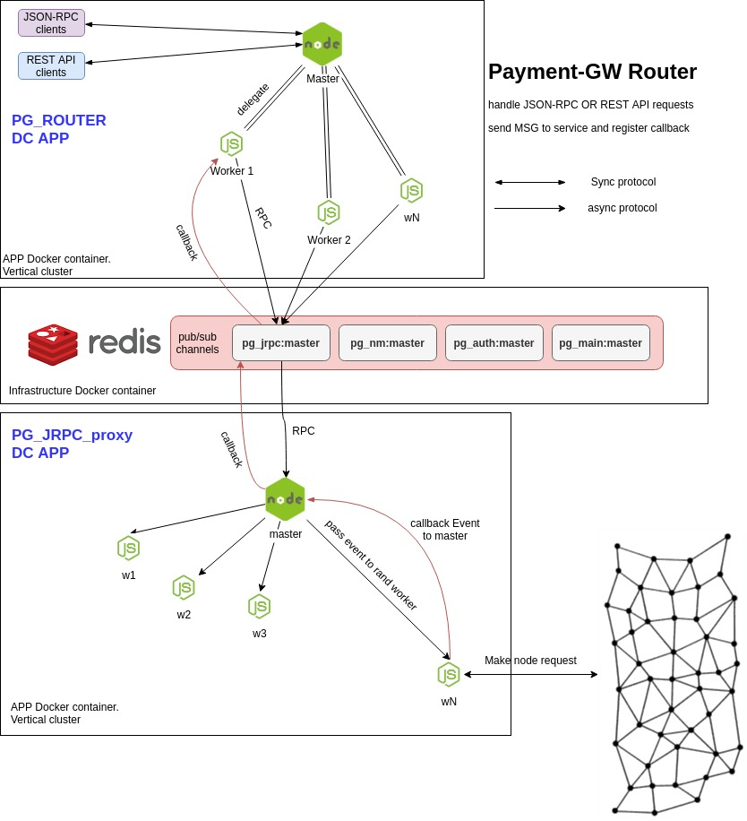

# PaymentGateway JSON-RPC proxy [PG_jrpc_proxy]

**PG_jrpc_proxy** is stateless async microservice with Redis RPC interaction  

### Components ###
* node.js vertical cluster ([MASTER] fork [WORKER] processes by count of CPU cores) 
* [MASTER] Redis RPC channel event handler
* [WORKER] BTC/LTC node request client wrapper (make JSON-RPC requests to node_type_cfg dynamically)
    
### Master process behavior ###
    1. [MASTER] init Redis RPC channel connection (async interaction)
    2. [MASTER] handel Redis RPC channel events and register Callback()
    3. [MASTER] pass events to random [WORKER] process
    4. [WORKER] handle request from [MASTER] and make JSON-RPC request to BTC/LTC node
    5. [WORKER] wait JSON-RPC response from BTC/LTC node and pass event to [MASTER]
    5. [MASTER] handle MSG from worker
    6. [MASTER] exec RPC callback done(err,data)

## architecture ##

